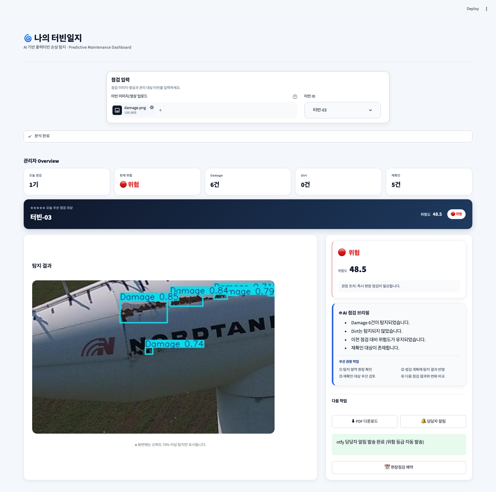

# Preview



# 🌪️ 나의 터빈일지

AI 기반 풍력 터빈 블레이드 손상 탐지 및 예방 정비 대시보드

드론으로 촬영한 풍력 터빈 이미지를 YOLO 모델로 분석해 `Damage`(손상)와
`Dirt`(오염)를 탐지하고, 탐지 신뢰도와 영역 크기를 바탕으로 위험 등급과
관리자 권장 조치를 제공하는 해커톤용 예방정비 데모입니다.

## 주요 기능

- JPG/PNG 터빈 이미지 업로드
- YOLO 기반 손상 및 오염 탐지
- 신뢰도 70% 이상 탐지 결과의 Bounding Box 표시
- 탐지 영역의 이미지 대비 면적 계산
- 정상·관찰·주의·위험 등급 자동 산정
- 등급별 권장 조치와 알림 정책 표시
- 관리자 Overview 요약 카드와 오늘의 우선 점검 대상 배너
- AI 점검 브리핑(점검 요약 + 우선 권장 작업 4가지) 자동 생성
- 이전 점검 대비 위험도 및 손상 변화 비교
- 객체별 위험도 계산 근거(클래스 가중치·면적비·신뢰도) 상세 제공
- 현장 제출용 PDF 점검보고서 다운로드
- **ntfy 푸시 알림으로 담당자에게 실시간 발송** (버튼 클릭 시 실제 네트워크 요청, 발송 성공/실패 화면 표시)
- 세션 내 점검 이력 기록 및 위험도 정렬
- 라이트 테마의 카드형 산업용 대시보드 UI

> 현재 버전은 데모 애플리케이션입니다. 점검 이력은 브라우저 세션에 저장되며,
> 서버를 다시 시작하거나 세션이 종료되면 초기화됩니다.
> 첫 점검의 `이전 점검 대비` 카드는 발표용 예시 기준값을 사용하며 화면에
> `DEMO BASELINE`으로 표시됩니다. 같은 세션의 다음 점검부터는 실제 직전 결과와 비교합니다.

## 빠른 시작

### 1. 저장소와 모델 확인

프로젝트 루트에 학습된 모델 `best.pt`가 있어야 합니다.

```text
wind-demo/
├── .streamlit/
│   └── config.toml       # Streamlit 라이트 테마
├── samples/
│   ├── damage.png        # 손상 데모 이미지
│   ├── dirt.png          # 오염 데모 이미지
│   └── normal.png        # 정상 데모 이미지
├── app.py                # Streamlit 대시보드
├── config.py             # 모델 경로 설정
├── severity.py           # 위험도 계산 및 등급 판정
├── best.pt               # 학습된 YOLO 모델
├── requirements.txt
└── README.md
```

모델이 저장소에 포함되지 않았다면 팀 공유 드라이브에서 받은 `best.pt`를
프로젝트 루트에 복사하세요. GitHub의 일반 파일 제한을 넘는 모델은 Git LFS나
별도 공유 링크로 관리하는 것을 권장합니다.

### 2. 가상환경 생성

Python 3.10 또는 3.11 사용을 권장합니다.

macOS/Linux:

```bash
python3 -m venv .venv
source .venv/bin/activate
```

Windows PowerShell:

```powershell
py -m venv .venv
.venv\Scripts\Activate.ps1
```

### 3. 의존성 설치

```bash
python -m pip install --upgrade pip
pip install -r requirements.txt
```

### 4. 실행

프로젝트 루트에서 다음 명령을 실행합니다.

```bash
streamlit run app.py
```

브라우저가 자동으로 열리지 않으면 터미널에 표시된 주소(기본값
`http://localhost:8501`)로 접속하세요.

## 사용 방법

1. `점검 입력`에서 `samples/`의 이미지 또는 드론 촬영 이미지를 업로드합니다.
2. 점검 대상의 터빈 ID를 입력합니다.
3. 모델 추론이 끝날 때까지 잠시 기다립니다.
4. 탐지 이미지, 위험도 등급, 권장 조치와 알림 정책을 확인합니다.
5. 필요하면 `🔔 담당자 알림` 버튼으로 현재 결과를 ntfy 푸시 알림으로 발송합니다.
6. 하단의 탐지 상세, 상세보기(등급 기준·계산 근거·통계), 점검 이력에서 결과를 비교합니다.

발표 시에는 `normal.png` → `dirt.png` → `damage.png` 순으로 시연하면 등급과
조치가 달라지는 흐름을 설명하기 좋습니다.

## 담당자 알림 (ntfy 푸시)

우측 패널의 `🔔 담당자 알림` 버튼을 누르면 현재 분석 결과를
[ntfy](https://ntfy.sh) 푸시 알림으로 실제 발송합니다.

- 기본 topic: `turbine-alarm-1234` ([app.py](app.py)의 `NTFY_TOPIC` 상수에서 변경 가능)
- 메시지 본문: 등급(`🟢 정상 (Lv0)` ~ `🔴 위험 (Lv3)`), 터빈 ID, 위험도, Damage/Dirt
  건수, 재확인 건수, 권장조치, 발송 시각
- 우선순위: `주의`·`위험` 등급은 priority 4, `정상`·`관찰`은 priority 3으로 발송
- 버튼 아래에 발송 상태가 표시됩니다.
  - 발송 전: `외부 채널 연동 전`
  - 성공: `ntfy 담당자 알림 발송 완료`
  - 실패: `알림 발송 실패: ...` (네트워크 오류 등 원인 포함)

실시간으로 폰에서 받아보려면 [ntfy 앱](https://ntfy.sh)을 설치하고 위 topic을
구독하세요. `turbine-alarm-1234`는 인증 없는 공개 topic이므로 데모/테스트
용도로만 사용하고, 실서비스에서는 비공개 topic이나 자체 호스팅 ntfy 서버 사용을
권장합니다.

## 위험도 판정 방식

- 신뢰도 40% 미만: 오탐 가능성이 높아 판정에서 제외
- 신뢰도 40% 이상 70% 미만: 자동 점수에서 제외하고 재확인 대상으로 표시
- 신뢰도 70% 이상: 클래스 가중치, 탐지 면적, 신뢰도로 위험도 계산
- `Damage`는 `Dirt`보다 높은 위험 가중치를 사용

| 위험도 | 등급 | 기본 권장 조치 |
|---:|---|---|
| 0 | 정상 | 이상 없음 |
| 0 초과 ~ 15 미만 | 관찰 | 정기점검 시 확인 |
| 15 이상 ~ 40 미만 | 주의 | 점검 계획 수립 |
| 40 이상 | 위험 | 즉시 점검 필요 |

판정 임계치와 알림 정책은 [severity.py](severity.py)에서 조정할 수 있습니다.

## 모델 경로 변경

기본 모델 경로는 프로젝트 루트의 `best.pt`입니다. 다른 모델을 사용할 때는
`WIND_MODEL_PATH` 환경변수로 경로를 지정할 수 있습니다.

macOS/Linux:

```bash
WIND_MODEL_PATH=/absolute/path/to/model.pt streamlit run app.py
```

Windows PowerShell:

```powershell
$env:WIND_MODEL_PATH="C:\path\to\model.pt"
streamlit run app.py
```

## 기술 스택

- Python
- Streamlit
- Ultralytics YOLO
- OpenCV
- Pandas
- NumPy
- Pillow
- ReportLab
- Requests (ntfy 푸시 알림 발송)

## 문제 해결

### 모델 파일을 찾을 수 없습니다

`best.pt`가 프로젝트 루트에 있는지 확인하거나 `WIND_MODEL_PATH`에 올바른
절대경로를 지정하세요.

### `streamlit` 명령을 찾을 수 없습니다

가상환경이 활성화되어 있는지 확인한 뒤 `pip install -r requirements.txt`를
다시 실행하세요. 명령 대신 `python -m streamlit run app.py`를 사용할 수도 있습니다.

### 첫 분석이 느립니다

첫 실행 시 모델 로딩 때문에 시간이 더 걸릴 수 있습니다. 이후 분석에서는
Streamlit의 모델 캐시를 재사용합니다. 현재 데모는 CPU에서도 실행되지만 GPU가
있으면 추론 시간이 단축됩니다.

### `알림 발송 실패`가 표시됩니다

`https://ntfy.sh`로 나가는 아웃바운드 연결이 방화벽/프록시에 막혀 있지 않은지
확인하세요. 사내망이나 오프라인 환경에서는 ntfy.sh에 접속할 수 없어 항상
실패로 표시됩니다. 화면에 표시되는 오류 메시지에 실제 원인(타임아웃, DNS 실패
등)이 함께 나옵니다.

## 향후 개선

- 드론 촬영 결과 자동 업로드
- GPS 기반 터빈 위치 연동
- Slack/SMS/이메일 등 추가 알림 채널 (현재는 ntfy 푸시만 실제 발송)
- 비공개 topic 또는 자체 호스팅 ntfy 서버 연동
- 점검 일정 및 작업자 배정
- 데이터베이스 기반 점검 이력 영구 저장
- 클라우드 배포 및 다중 사용자 대시보드
